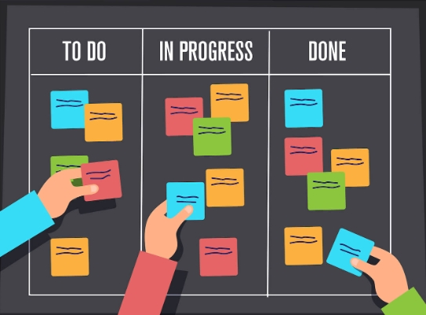

# **_Task Tracker_**

### This is task about tracker which contains in the projects and search all tasks in project.

#### I am using most popular pattern MVC, in this project using in SwaggerUI instead custom View.

**App create documentation with Swagger.**

_**In this app used if you need install with packages you can use this command from terminal. All packages have last stable versions:**_
- Microsoft.EntityFrameworkCore -- https://www.nuget.org/packages/Microsoft.EntityFrameworkCore
- Microsoft.EntityFrameworkCore.SqlServer -- https://www.nuget.org/packages/Microsoft.EntityFrameworkCore.SqlServer
- Microsoft.EntityFrameworkCore.Design -- https://www.nuget.org/packages/Microsoft.EntityFrameworkCore.Design
- dotnet-ef tool -- https://www.nuget.org/packages/dotnet-ef#readme-body-tab

**In Directory "DataBaseBackup". You can find DataBase backup and restore database on your SSMS (Sql Server Management Studio), also in this directory have Data Tier file for restore DataBase from Data-Tier Application**